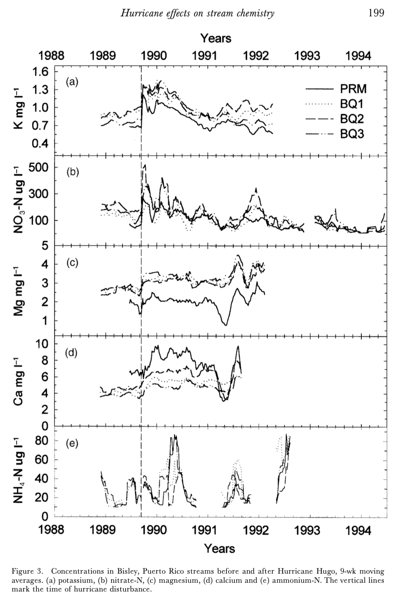

# EDS214 Final Project: Figure Reproducibility

## Description:

This repository contains scripts, documentation, and data to recreate Figure 3 from Schaefer et al. (2000), shown below this description. This is the final project for EDS214, with the main goal of replicating this publication's Figure 3 through the implementation of code automation, organization, documentation, and collaboration techniques learned in this class. See the Repository Layout table below for navigational tools for this repository and additional details on this project workflow. The GitHub Page website for this project is here: [https://ssoriano22.github.io/sms214final/paper.html](<https://ssoriano22.github.io/sms214final/paper.html>)

## Repository Layout:

| File/Directory Name | Description |
| ------------------- | ------------------- |
| [data/](data/) | Directory containing all raw data csv files for this project. |
| [docs/](docs/) | Directory containing all html files and rendering files for this project, generated from paper.qmd. Also contains Schaefer et al. (2000) Figure 3 image.|
| [output/](output/) | Directory containing all intermediate data outputs generated by 1_clean_data.R for this project. |
| [paper/](paper/) | Directory containing the cited publication for this project, Schaefer et al. (2000), the paper.qmd file for this project, and the related yml file. |
| [R/](R/) | Directory containing all utility R scripts for this project. |
| [scratch/](scratch/) | Directory containing all scratch code and documents for this project. |
| [1_clean_data.R](1_clean_data.R) | R script used to clean raw data and output intermediate data file to output/. |
| [peer_assessment.md](peer_assessment.md) | Markdown file for the peer-assessment on 27AUG2026. |
| [self_assessment.md](self_assessment.md) | Markdown file for the self-assessment on 27AUG2026. |

## Current Contributors:

Michaela Dennis - [GitHub](<https://github.com/michaeladennis>)

Priscilla Pierce - [GitHub](<https://github.com/pr-scilla>)

Sophia Soriano - [GitHub](<https://github.com/ssoriano22>), [LinkedIn](<https://www.linkedin.com/in/smsoriano22>)

## References:

McDowell, William H., and USDA Forest Service. International Institute Of Tropical Forestry (IITF). 2024. “Chemistry of Stream Water from the Luquillo Mountains.” Environmental Data Initiative. https://doi.org/10.6073/PASTA/F31349BEBDC304F758718F4798D25458.

Schaefer, D.A.; McDowell, W.H.; Scatena, F.N., and Asbury, C.E. (2000): Effects of hurricane disturbance on stream water concentrations and fluxes in eight tropical forest watersheds of the Luquillo Experimental Forest, Puerto Rico. _Journal of Tropical Ecology_.
